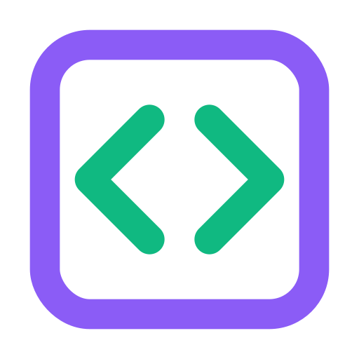

<div align="center">



# Next.js Template (DevKit)

<a href="LICENSE"></a>
<a href="https://nextjs.org/"></a>
<a href="https://reactjs.org/"></a>
<a href="https://www.typescriptlang.org/"></a>
<a href="https://tailwindcss.com/"></a>

**A modern Next.js starter with App Router, TypeScript, Tailwind CSS 4, and a script to generate web app icons from a single SVG.**

[Features](#-features) • [Installation](#-installation) • [Running & Building](#-running-the-application) • [Icons](#-icons-generation) • [Contributing](#-contributing)

---

</div>

## 📖 Table of Contents

- [About](#-about)
- [Features](#-features)
- [Technology Stack](#-technology-stack)
- [Prerequisites](#-prerequisites)
- [Installation](#-installation)
- [Running the Application](#-running-the-application)
- [Building for Production](#-building-for-production)
- [Icons Generation](#-icons-generation)
- [Project Structure](#-project-structure)
- [Configuration](#-configuration)
- [Contributing](#-contributing)
- [Support](#-support)
- [License](#-license)
- [About Roboticela](#-about-roboticela)

---

## 🌟 About

**NextJS-Template-DevKit** (Roboticela DevKit) is a production-ready starter for building **Next.js** web applications with the **App Router**, **TypeScript**, and **Tailwind CSS 4**. It includes a script to generate **favicon and web app icons** from a single SVG so your branding stays consistent.

### Why This Template?

- ✅ **Next.js 16** — App Router, React Server Components, fast refresh
- ✅ **TypeScript** — Type-safe development
- ✅ **Tailwind CSS 4** — Utility-first styling with modern tooling
- ✅ **Icon Pipeline** — Single SVG → favicon.ico, favicon-32x32.png, apple-touch-icon.png
- ✅ **Simple & Focused** — No extra backends or native layers; ready to extend

---

## ✨ Features

### 🖥️ Frontend
- **Next.js 16** — App Router, server and client components
- **React 19** + **TypeScript** — Type-safe UI
- **Tailwind CSS 4** — PostCSS-based setup
- **Geist fonts** — Optional Google fonts in layout

### 🎨 Icons
- **Single source** — `public/favicon.svg` (or custom path)
- **Web only** — Generates favicon.ico, favicon-32x32.png, favicon-16x16.png, apple-touch-icon.png
- **Non-interactive** — No prompts; run and get icons in `public/`

---

## 🛠️ Technology Stack

| Layer     | Technology |
|----------|------------|
| Framework| Next.js 16 (App Router) |
| UI       | React 19, TypeScript 5.x |
| Styling  | Tailwind CSS 4 |
| Tooling  | ESLint, npm |

---

## 📋 Prerequisites

- **Node.js** (v20+) — [Download](https://nodejs.org/)
- **npm** — Node package manager

---

## 📥 Installation

```bash
git clone https://github.com/Roboticela/NextJS-Template-DevKit.git
cd NextJS-Template-DevKit
npm install
```

---

## 🚀 Running the Application

### Development

```bash
npm run dev
```

Then open [http://localhost:3000](http://localhost:3000). Edits to the app will hot-reload.

### Production (local)

```bash
npm run build
npm run start
```

Serves the built app (default port 3000).

---

## 📦 Building for Production

```bash
npm run build
```

Output is in `.next/`. Use `npm run start` to serve it, or deploy to Vercel, Node, or any platform that supports Next.js.

---

## 🎨 Icons Generation

Icons are generated from a **single source image** (default: `public/favicon.svg`) so that all web assets stay in sync.

### Command

```bash
npm run icons:generate
```

Or with a custom source path (relative to project root or absolute):

```bash
node scripts/icons-generate.js path/to/icon.svg
```

### What it does

1. **Reads** the source SVG (or image) from the given path (default `public/favicon.svg`).
2. **Generates** PNGs and ICO in `public/`:
   - `favicon-16x16.png`
   - `favicon-32x32.png`
   - `apple-touch-icon.png` (128×128)
   - `favicon.ico` (16×16 and 32×32, if the `to-ico` package is installed)

### Dependencies

The script uses **sharp** (and optionally **to-ico**) to rasterize SVG and build the ICO. They are listed as devDependencies; after `npm install`, `npm run icons:generate` works without extra setup.

---

## 📁 Project Structure

```
NextJS-Template-DevKit/
├── app/
│   ├── globals.css       # Global styles (Tailwind + theme)
│   ├── layout.tsx        # Root layout (metadata, fonts)
│   └── page.tsx          # Home page
├── public/
│   ├── favicon.svg       # Default icon source for icons:generate
│   └── ...               # Generated favicon-32x32.png, apple-touch-icon.png, etc.
├── scripts/
│   └── icons-generate.js  # Web icon generation from SVG
├── package.json
├── tsconfig.json
├── next.config.ts
├── postcss.config.mjs
├── tailwind.config.ts
├── LICENSE
└── README.md
```

---

## ⚙️ Configuration

### Next.js
- **`next.config.ts`** — Next.js config (images, redirects, etc.).
- **`app/layout.tsx`** — Metadata (title, description), fonts, and root HTML.

### Styling
- **`app/globals.css`** — Tailwind import, CSS variables, and global styles.
- **`tailwind.config.ts`** — Tailwind theme and content paths.

### Icons
- **`public/favicon.svg`** — Default source for `npm run icons:generate`. Replace with your own SVG to regenerate all web icons.

---

## 🤝 Contributing

1. Fork the repository.
2. Create a branch: `git checkout -b feature/your-feature` or `fix/your-fix`.
3. Make changes; follow existing style (ESLint, TypeScript).
4. Commit with a clear message (e.g. `Add: ...`, `Fix: ...`, `Docs: ...`).
5. Push and open a Pull Request.

---

## 💬 Support

- **Issues:** [GitHub Issues](https://github.com/Roboticela/NextJS-Template-DevKit/issues) for bugs and feature requests.
- **Repository:** [Roboticela/NextJS-Template-DevKit](https://github.com/Roboticela/NextJS-Template-DevKit).

---

## 📄 License

This project is licensed under the **MIT License**. See [LICENSE](LICENSE) for the full text.

---

## 🏢 About Roboticela

<div align="center">
   
</div>

**[Roboticela](https://github.com/Roboticela)** maintains this template for building modern web apps with Next.js. Star the repo if you find it useful.

---

<div align="center">

**Built with ❤️ by [Roboticela](https://github.com/Roboticela)**

[⬆ Back to Top](#-nextjs-template-devkit)

</div>
